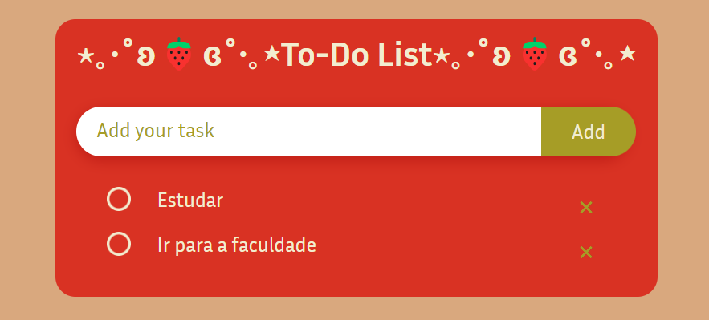

# To Do List

Aplicação simples de lista de tarefas (to-do list) desenvolvida em JavaScript. O foco do projeto foi estudar e praticar manipulação do DOM, eventos e armazenamento de dados no `localStorage` do navegador.

## Funcionalidades

- Adicionar tarefas à lista.
- Marcar tarefas como concluídas.
- Remover tarefas da lista.
- As tarefas são salvas no `localStorage`, então permanecem disponíveis mesmo após recarregar a página.
